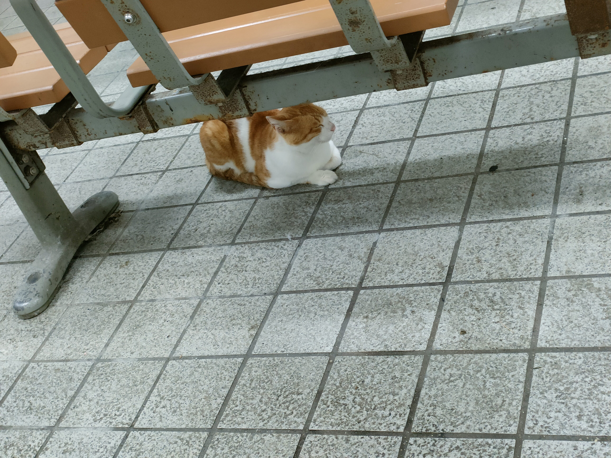

# 8月17日

### 深夜3時35分頃
私は突然目を覚ます。とてもダルく、インフルエンザにかかったような気分だった。昨日のお茶を全く飲んでいないことに気が付き、バックからペットボトルを取り出してそれをがぶ飲みした。（最近気がついたのだがペットボトルを再利用するのはどうやら一般的ではないらしい。）

### 午前7時25分頃
予定より5分遅く起きる。電車に乗り遅れそうになった。

### 午前7時50分頃
駐輪場にて自分の自転車が直されていることに気がつく。1週間ほど前にチェーンが外れ、駐輪場のおばさんに修理のお願いをしていたのだ。おばさんに2750円の支払いを命じられた。お財布をみたが一万円札しか見当たらず、一万円を誤りながら渡した。

おばさんはなにやら手続きの準備をしていて、私にはしばらく考える時間があったので、払う金額を工夫しお釣りを少なくできないか考えた。+50円払うことにした。（お小遣いが少なく買い物をし始めたのは最近でお金の使い方がわからない。）  
自分の自転車よりも、駐輪場の自転車の方が乗りやすかったので、少しがっかりした気持ちの中支払を済ませた。

### 午前9時15分頃
体育でテニスの試合形式の説明を受ける。素数を判定するアルゴリズムで平方根を使える理由を考えていると、説明が頭に入ってこなかった。というか、それ以前に説明を聞く姿勢がだめだった。要点を死ぬ気で聞こうとするべきだった。

### 午後12時50分
政治・経済の授業を受けた。授業冒頭、選挙についての話をしてくれたが、頭に入ってこない内容が一部あった。何故かは今考えても分からないが、死ぬ気で聞けば良かったのにと思う。

### 午後5時頃
部室にてロボットのモーターを手で動かすとLEDテープが光るという苦情がくる。安全上良くないのではとの指摘を受けた。『こんなのパチンコの確定演出だ』と言われた。問題なのかわからなかったので、回路班のメンバーのグループチャットで報告した。

### 午後5時半頃
ロボットのモーターが1つしか動かないという報告を受ける。他のロボットは同じプログラムで動いているので、プログラムのせいではないだろうと思いつつも、念の為コントローラーとロボットとの間の無線通信を調べる。プログラムには問題がないということがわかる。

諦めて、素数アルゴリズムのレポートについて考えていると、先生が現れた。即座に現状を説明し、協力を仰いだ。先生が回路の電源をつけても、コントローラーで動かせないという現象が起きた。私は非常電源がついていないことに気が付き、直ぐにつけた。『非常電源が付いてなかったので付けました。』と言いながら先生の方を見ると、先生は回路に首を突っ込んでいた。先生から、『勝手につけないで』と注意されてしまった。

私は一瞬『先生が非常電源が付いていることを想定した状態で首を突っ込んでいるのだから、私が付けようとそれは想定範囲内なのでは』というような違和感を覚えた。その後一瞬に、『先生は非常電源を付け忘れたのではなく。あえてつけなかった。』ということに気がついた。私の間違いだった。正直、自分が悪かったとは思えないが、これからは非常電源の取り扱いにもう少し注意しようと思った。

### 午後6時5分頃
昼ごはんを食べ忘れていることに気がつく。もう帰るつもりだったので、電車で食べようと考えた。

### 午後6時15分頃
ローソン近くのバス停の前で自転車のチェーンが外れる。軍手で直そうとしたが、以前と同じく直せなかった。2750円をドブに捨ててしまった。チョコアイス21個分である。許せない。イライラしながら、自転車を大島商船の駐輪場まで引いた。途中、後ろから大島商船に向かってバスが通り過ぎて行くのが見えた。

### 午後6時35分頃
寮生を見かける。『おつかれ』と聞こえたので私は『おつかれ』と返した。しばらくしてどうやらそれは私に向けられたものではないということに気がついた。

### 午後7時頃
ローソン近くのバス停の前に徒歩で着いた。食べる場所がないかずっと伺っていたのだ。ベンチに座り、弁当を食べ始めた。作ってもらっておいてこんなこと言うのはよろしくないが相変わらず美味しくない。寮食は不味いとよく言われていたが、弁当と比べればそんなことないと思う。しばらくすると前におならをしながら通り過ぎていくおじさんがいて不快だった。

### 午後7時43分
大畠駅前の横断歩道で、コンビニの方から駅の方に向かって、信号待ちをしていると、目の前で電車が止まっているのが見えた。間に合わなかったのだ。

それから、駅の控室？の席に座った。例のごとく、野良猫が入ってきた。恐らく餌目的だろう。人間に懐けば、餌がもらえると思ってるのだろう。私は野生動物にエサをあげることに対し、悪いイメージがあるので無視した。するとと、ゴミを漁りだした。それでも無視をしていると、地面の小さな石を舐め始めた。よく見ると、痩せて見えるような気がする。普通の猫とはなんなのかを知らないのでわからないがそんな気がした。

迷った結果、仕方なくコンビニで何か食べ物を買うことにした。駅に戻ってくるまでに猫がいなくなっている可能性が考えられるので、自分が好きな食べ物にした。チョコレートだ。チョコレートのチップのスティックを買った。

駅に戻るとまだ居た。1本をちぎって、あげた。直ぐに食いついた。私も椅子に座り食べ始めた。1本の半分を食べたところで疑問が生じた。『ネコにチョコをあげていいのか？』直ぐにスマホを取り出し、調べた。私はしばらく読んでハッとし、地面に散りばめられたスティックを手に取った。ドアを閉めた。しばらく調べ続けた。窓を閉め、密室にした。猫はしつこくなんども私に近寄ってきた。

2つぐらいの病院に電話をかけたが、かからなかった。仕方なく親に連絡した。『死んだら責任取れない。調べるのを手伝って欲しい。』と言うと、『野良猫なら問題ない』と言われた。相変わらず無責任な人だ。時間の無駄なので電話を切った。

病院に手当たり次第かけていると繋がった。状況を説明すると、『少量なので問題ないと思われる。ただ、問題があれば連れてきて欲しい。猫に無闇に食べ物を与えないように。』と言われた。私は感謝の言葉を述べ電話を切った。私が拾って手に持っているチョコスティックを、猫は未だに求めてくる。私はそのスティックをゴミ箱に捨てた。それからコンビニに手を洗いに行った。

*（※『その他のゴミ』みたいなところに入れました。もし捨ててはいけないとこだったらごめんなさい。）*  
*（※かかった病院について、今調べてみると『きよときペットクリニック』と言うそうです。ありがとう御座いました。）*

それから猫の様子を見ると猫は目をつぶりだした。寝始めた。  
そして電車が来た。私は猫の体調に問題ないと判断し、電車に乗った。

### 午後10時16分30秒
**家私の部屋敷き布団の上**  
今日は反省すべき日である。そう思いながら、この日記を書き終わる。

